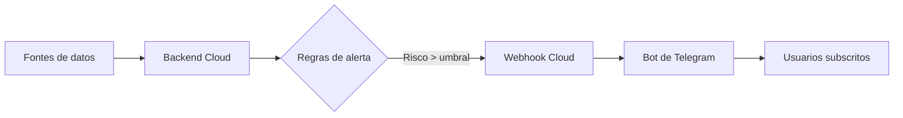

Vale — te reescribo el documento dejando claro que el proyecto está **desplegado en cloud**, simplificando las referencias a Docker local y adaptándolo a la arquitectura final que utilizasteis.

---

# 🔥 GaliciaVixía

**Sistema de alerta temperá de incendios forestais en Galicia**

> 🏆 *Proxecto desenvolvido para o HackUDC 2026 - Reto Grafana Labs*

---

## 🎯 Que é?

Un sistema de monitorización e alerta en tempo real do risco de incendios forestais en Galicia, baseado en arquitectura cloud, que combina datos meteorolóxicos públicos e analítica de series temporais para xerar alertas preventivas.

| Dato                                                       | Fonte                  | Actualización |
| ---------------------------------------------------------- | ---------------------- | ------------- |
| 🌡️ Temperatura e humidade                                 | MeteoGalicia API       | 10 min        |
| 💨 Velocidade e dirección do vento                         | MeteoGalicia API       | 10 min        |
| 🌧️ Probabilidade e acumulación de choiva                  | MeteoGalicia API       | 10 min        |
| ☀️ Índice de radiación solar e insolación                  | MeteoGalicia API       | 10 min        |
| 🔥 Índice estimado de risco de incendio (FWI simplificado) | Motor analítico propio | 5 min         |


## 🚨 Como funciona?



1. **Recolección de datos** desde APIs públicas cada 10 minutos mediante o plugin Infinity.
2. **Procesamento analítico** en Prometheus e motor de queries de Grafana.
3. **Detección automática** de risco mediante regras de alertado.
4. **Notificación en tempo real** vía Telegram.
5. **Filtrado por usuario**, permitindo subscricións por zona xeográfica.

---

## 🛠️ Tecnoloxía e arquitectura

| Capa             | Tecnoloxía              | Función                   |
| ---------------- | ----------------------- | ------------------------- |
| 📊 Visualización | Grafana LGTM Cloud      | Dashboards e alertas      |
| 🗄️ Métricas     | Prometheus              | Series temporais          |
| 🔌 Integración   | Infinity Plugin         | Consumo de APIs externas  |
| 🤖 Notificacións | Bot Python + Webhook    | Comunicación con Telegram |
| ☁️ Despregue     | Infraestrutura cloud    | Alta dispoñibilidade      |
| 🌐 Exposición    | Endpoint seguro público | Recepción de alertas      |

---

## 🚀 Despregue en Cloud

O sistema está despregado en infraestrutura cloud, eliminando dependencias de contedores locais.

Características do despregue:

* Backend accesible mediante endpoints HTTPS.
* Escalabilidade automática.
* Persistencia de datos en base de datos remota.
* Monitorización continua.

---

## ⚙️ Configuración da plataforma

### 1. Acceso á interface

* URL pública proporcionada no despregue cloud.
* Usuario administrador protexido con credenciais.

### 2. Datasources

* Fonte principal: Prometheus ou compatible.
* Endpoint configurado no panel de administración.

---

## 📊 Alertas intelixentes

Regra de exemplo empregada no sistema:

* Query: índice de risco forestal.
* Umbral típico de alerta:

  * ⚠️ Moderado: > 40
  * 🔥 Alto: > 60

Metadatos das alertas:

* Zona xeográfica.
* Severidade.
* Resumo automático da condición de risco.

---

## 🔗 Webhooks de notificación

O sistema utiliza webhooks seguros para integración con bots externos.

Formato de payload:

```json
{
  "alerts": [
    {
      "zona": "Ourense",
      "severity": "MODERADO",
      "value": 55.3,
      "status": "firing"
    }
  ]
}
```

---

## 🤖 Comandos do bot de Telegram

| Comando              | Función                    |
| -------------------- | -------------------------- |
| `/start`             | Mensaxe de benvida         |
| `/risco [zona]`      | Consultar risco actual     |
| `/subscribir [zona]` | Recibir alertas dunha zona |
| `/mis_alertas`       | Ver subscricións           |
| `/desubscribir`      | Cancelar alertas           |

---

## 🧪 Filosofía do proxecto

GaliciaVixía está deseñado como un sistema de **alerta preventiva**, non só de monitorización, contribuíndo á redución do impacto dos incendios forestais mediante comunicación temperá.

---

**GaliciaVixía - HackUDC 2026** 🔥🌲🛡️

