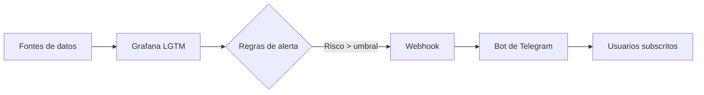

# 🔥 GaliciaVixía

**Sistema de alerta temperá de incendios forestais en Galicia**

> 🏆 *Proxecto desenvolvido para o HackUDC 2026 - Reto Grafana Labs*

---

## 🎯 Que é?

Un dashboard en Grafana que monitoriza en tempo real o risco de incendios combinando:

| Dato | Fonte | Actualización |
|------|-------|---------------|
| 🌡️ Temperatura e humidade | MeteoGalicia API | 10 min |
| 💨 Velocidade do vento | MeteoGalicia API | 10 min |
| 💧 Séqueda acumulada | Abertos.Xunta.gal | Diaria |

---

## 🚨 Como funciona?



1. **Recolección**: O plugin *Infinity* consulta APIs públicas cada 10 minutos.
2. **Procesamento**: Prometheus calcula o índice FWI en tempo real.
3. **Detección**: Grafana Alerting evalúa regras personalizadas por concello.
4. **Notificación**: Cando se supera un limiar, envíase unha alerta push por Telegram.
5. **Filtrado**: Cada usuario recibe SOLO as alertas das zonas ás que se subcribiu.

---

## 🛠️ Tecnoloxías

| Capa | Tecnoloxía | Función |
|------|-----------|---------|
| 📊 Visualización | Grafana OSS + LGTM | Dashboards e alertas |
| 🗄️ Métricas | Prometheus | Almacenamento e consultas |
| 🔌 Integración | Infinity Plugin | Conexión a APIs externas |
| 🤖 Notificacións | Bot Python + Flask | Webhook → Telegram |
| 🌐 Exposición | ngrok | Túnel seguro para testing |
| 🐳 Despregue | Docker | Contedorizado de Grafana |

---

## 🚀 Instalación rápida

### ✅ Requisitos previos

- Docker Desktop 20.10+
- Python 3.9+
- ngrok 3.x+
- Conta de Telegram (@BotFather)

### 📦 Paso 1: Clonar o repositorio

```bash
git clone https://github.com/YGA-13/GaliciaVixia.git
cd GaliciaVixia
```

### 🐳 Paso 2: Descargar e executar Grafana LGTM

```bash
# Descargar a imaxe
docker pull grafana/otel-lgtm:latest

# Crear cartafol para datos persistentes
mkdir -p ./Docker

# Executar o contedor (Linux/Mac)
docker run -d \
  -p 3000:3000 -p 9090:9090 -p 3100:3100 \
  -v $(pwd)/Docker:/data \
  -e "GF_PLUGINS_PREINSTALL_SYNC=yesoreyeram-infinity-datasource" \
  --name grafana-lgtm \
  grafana/otel-lgtm:latest
```

> 💡 **Windows (Git Bash)**: Usa rutas estilo Unix:  
> `-v /c/Users/<TEU_USUARIO>/GaliciaVixia/Docker:/data`

### 🔗 Paso 3: Expor Grafana con ngrok

```bash
ngrok http 3000
```

📋 Copia a URL que aparece:  
`https://xxxx-xxx-xxx-xxx.ngrok-free.app`

### 🤖 Paso 4: Configurar e executar o bot

```bash
cd bot

# Crear e activar entorno virtual
python -m venv .venv
source .venv/Scripts/activate  # Windows Git Bash
# source .venv/bin/activate    # Linux/Mac

# Instalar dependencias
pip install -r requirements.txt

# Configurar variables
cp .env.example .env
# Edita .env e engade:
# TELEGRAM_BOT_TOKEN=123456:ABC-xyz...
# GRAFANA_URL=https://tua-url.ngrok-free.app

# Executar o bot
python bot.py
```

---

## ⚙️ Configuración de Grafana

### 1. Acceder á interface
- URL: `http://localhost:3000`
- Usuario: `admin` / Contraseña: `admin` (cámbiaa ao entrar)

### 2. Engadir o datasource de Prometheus
- Vai a **Connections > Data sources > Add new data source**
- Selecciona **Prometheus**
- URL: `http://localhost:9090` (ou `http://host.docker.internal:9090` se usas Docker en Mac/Windows)
- Guarda e proba a conexión

### 3. Importar o dashboard
- Vai a **Dashboards > New > Import**
- Pega o JSON do ficheiro `grafana/dashboard.json` (ou créao manualmente)

### 4. Configurar as alertas
- Vai a **Alerting > Alert rules**
- Crea unha regra con:
  - **Query**: `fire_risk_index{zona=~".*"}`
  - **Condition**: `WHEN last() OF query(A, 5m, now) IS ABOVE 40`
  - **Labels**: `zona = "{{ $labels.zona }}"`, `severity = "{{ $labels.severity }}"`
  - **Annotations**: `summary = "Risco elevado en {{ $labels.zona }}"`

### 5. Configurar o Contact Point (Webhook)
- Vai a **Alerting > Contact points > Add contact point**
- Tipo: **Webhook**
- URL: `https://tua-url.ngrok-free.app/webhook/grafana`
- HTTP Method: `POST`
- Content Type: `application/json`

---

## 🤖 Comandos do bot de Telegram

| Comando | Función | Exemplo |
|---------|---------|---------|
| `/start` | Mostrar menú de benvida | `/start` |
| `/risco [zona]` | Consultar risco actual | `/risco Ourense` |
| `/subscribir [zona]` | Recibir alertas dunha zona | `/subscribir Vigo` |
| `/subscribir Galicia` | Recibir alertas de TODAS as zonas | `/subscribir Galicia` |
| `/mis_alertas` | Ver as túas subscricións activas | `/mis_alertas` |
| `/desubscribir [zona]` | Cancelar unha subscrición | `/desubscribir Lugo` |
| `/desubscribir` | Cancelar TODAS as subscricións | `/desubscribir` |
| `/axuda` | Mostrar instrucións de uso | `/axuda` |

---

## 🧪 Probas rápidas

### Probar o webhook con curl

```bash
curl -X POST https://tua-url.ngrok-free.app/webhook/grafana \
  -H "Content-Type: application/json" \
  -d '{
    "alerts": [{
      "labels": {
        "zona": "Ourense",
        "severity": "MODERADO"
      },
      "annotations": {
        "summary": "Risco elevado por vento e baixa humidade"
      },
      "value": 55.3,
      "status": "firing"
    }]
  }'
```

✅ Deberías recibir en Telegram:
```
🔥 *ALERTA INCENDIO*

📍 Zona: Ourense
⚠️ Nivel: MODERADO
📊 Valor: 55.3
📝 Risco elevado por vento e baixa humidade

_⚠️ Evita fogueiras, queimas e actividades con lume._

_GaliciaVixía - HackUDC 2026_
```

### Probar a consulta de risco

En Telegram, escribe:
```
/risco Ourense
```

✅ Deberías ver os datos máis recentes almacenados na caché.


**GaliciaVixía - HackUDC 2026** 🔥🌲🛡️